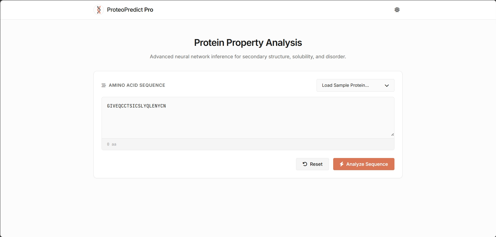
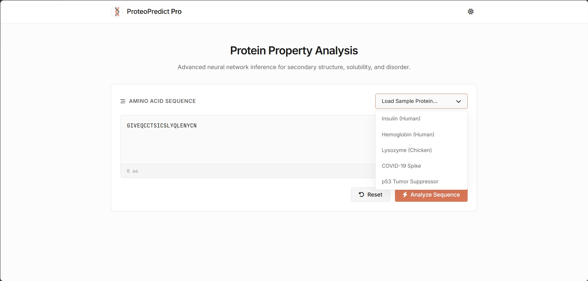
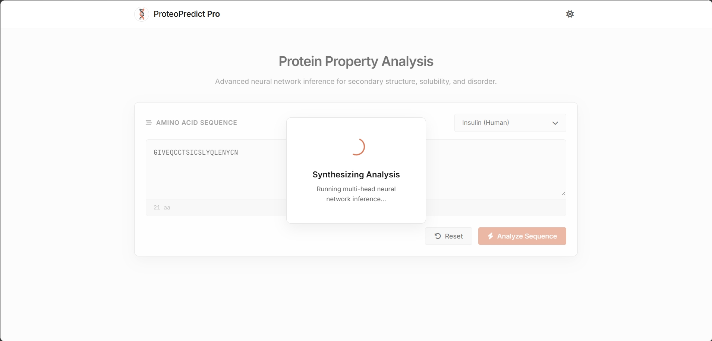
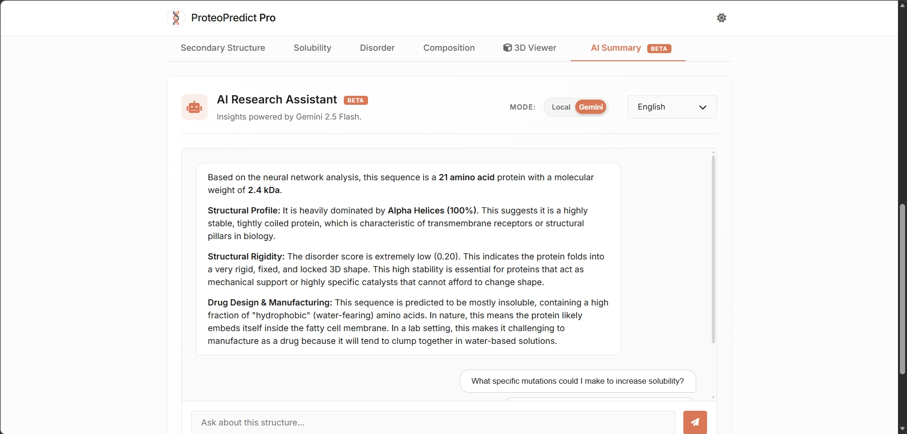
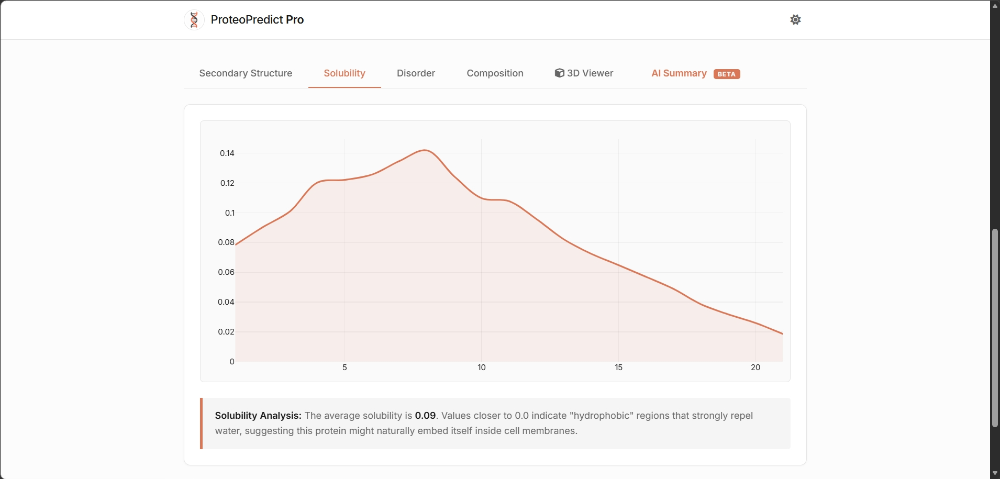

<h1>
  
  ProteoPredict Pro
</h1>

<p><strong>Advanced Serverless Neural Network Inference for Protein Structure, Solubility, and Disorder.</strong></p>

<p>
  <a href="https://proteopredict-pro.web.app" target="_blank">
    
  </a>
</p>

------

## Overview-

**ProteoPredict Pro** is a cutting-edge web application designed to democratize deep learning in bioinformatics. It provides researchers and students with a rich, interactive platform to predict protein secondary structures, evaluate solubility, map disordered regions, and chat contextually with a Gemini-powered AI Assistant—all happening **entirely within the browser**.

By porting a custom-trained **1D CNN + Bidirectional LSTM** model directly into TensorFlow.js, ProteoPredict Pro eliminates the need for expensive backend GPU servers. It runs natively on the client device, ensuring privacy, speed, and zero latency.

---

## Application Gallery

| Dashboard & Interface | Sequence Selection |
| :---: | :---: |
|  |  |
| *Modern glassmorphism UI with intuitive controls.* | *Pre-loaded biological sequences for rapid testing.* |

| Structural Analysis | 3D Visualization |
| :---: | :---: |
|  |  |
| *In-browser inference predicting Helix, Sheet, and Coil.* | *Automated RCSB PDB fetching and 3D rendering.* |

| AI Assistant & Insights | Advanced Metrics |
| :---: | :---: |
|  |  |
| *Integrated Gemini AI for sequence-specific Q&A.* | *Multi-task predictions including Solubility and Disorder.* |

---

## Key Features

* **Serverless AI Inference:** A 1D CNN + BiLSTM model running directly in your browser using **TensorFlow.js**. No backend latency, completely private.
* **Context-Aware AI Chat:** Powered by the **Google Gemini SDK**, ask an integrated AI assistant to analyze structural implications, identify domain functions, or explain sequence properties.
* **3D Molecule Integration:** Automatic detection of standard proteins with embedded **3Dmol.js** viewers to visualize the PDB structures interactively.
* **Premium Aesthetics:** Responsive glassmorphism design, smooth micro-animations, customizable dark/light modes, and interactive data visualization.
* **Multi-Task Prediction:** 
  * **Secondary Structure:** Classifies into Alpha Helix (H), Beta Sheet (E), and Random Coil (C).
  * **Solubility:** Predicts the likelihood of the protein being soluble upon expression.
  * **Disorder:** Maps intrinsically disordered regions across the sequence.

---

## Technical Architecture

ProteoPredict Pro utilizes a modern, pure client-side stack:

1. **Machine Learning Base:** 
   * A multi-head Keras (v3) model trained in Python on the CullPDB dataset.
   * Converted to `model.json` format using the official `tensorflowjs_converter`.
   * Schema incompatibilities and weight mappings heavily customized for strict TF.js parsing.
2. **Frontend Logic:**
   * **Vanilla JavaScript** (ES6+) without heavy frontend frameworks to ensure maximum performance.
   * **TensorFlow.js (`@tensorflow/tfjs`)** for loading the model graph and performing tensor operations.
   * **Gemini SDK** lazy-loaded on demand for the conversational AI module.
3. **Deployment:**
   * Deployed statically on **Firebase Hosting**.

---

## Local Development

Because the heavy lifting is done in the browser, setting up ProteoPredict Pro locally is incredibly simple.

### Prerequisites
* A modern web browser.
* A local development server (e.g., Python's `http.server`, or Node's `http-server`).
* *Note: Opening `index.html` directly via the `file://` protocol will cause CORS errors when loading the `.bin` weight files.*

### Steps
1. **Clone the repository:**
   ```bash
   git clone https://github.com/your-username/ProteoPredict-Pro.git
   cd ProteoPredict-Pro
   ```

2. **Start a local web server** (from the root directory):
   ```bash
   # Using Python
   python -m http.server 8000
   
   # Or using Node.js
   npx http-server -p 8000
   ```

3. **Open your browser:**
   Navigate to `http://localhost:8000/frontend/`

---

## Repository Structure

```text
ProteoPredict-Pro/
│
├── frontend/
│   ├── index.html          # Main application interface
│   ├── style.css           # Custom CSS with glassmorphism UI
│   ├── script.js           # Core logic, TF.js inference, and Gemini integration
│   └── model/              # Converted TF.js model files
│       ├── model.json      # Network topology and weight manifest
│       └── *.bin           # Binary weight shards
│
├── public/                 # Screenshots and presentation assets
├── notebooks/              # Original Python Jupyter notebooks & .h5 Keras model
└── firebase.json           # Firebase Hosting configuration
```

---

## License & Acknowledgements

* Original Deep Learning Architecture trained on the CullPDB dataset.
* 3D Visualizations powered by [3Dmol.js](https://3dmol.csb.pitt.edu/).
* Large Language Model capabilities driven by [Google Gemini](https://deepmind.google/technologies/gemini/).
